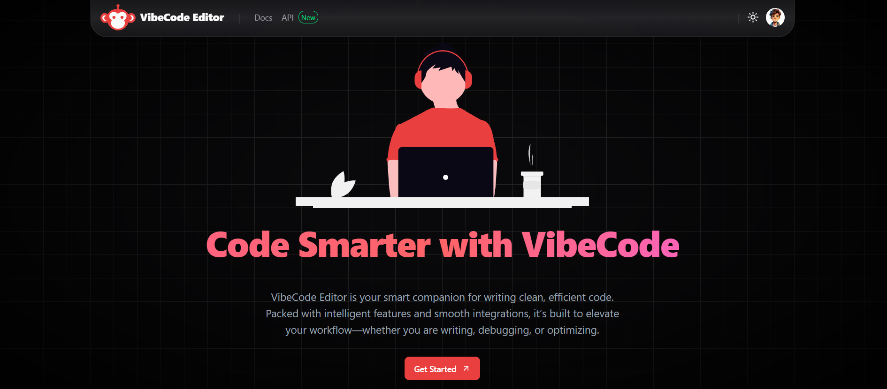
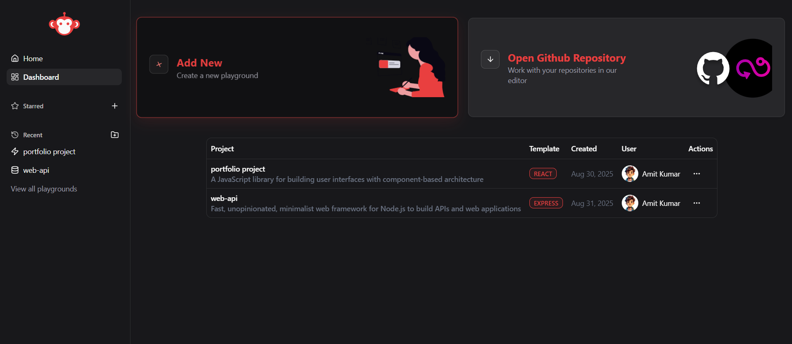
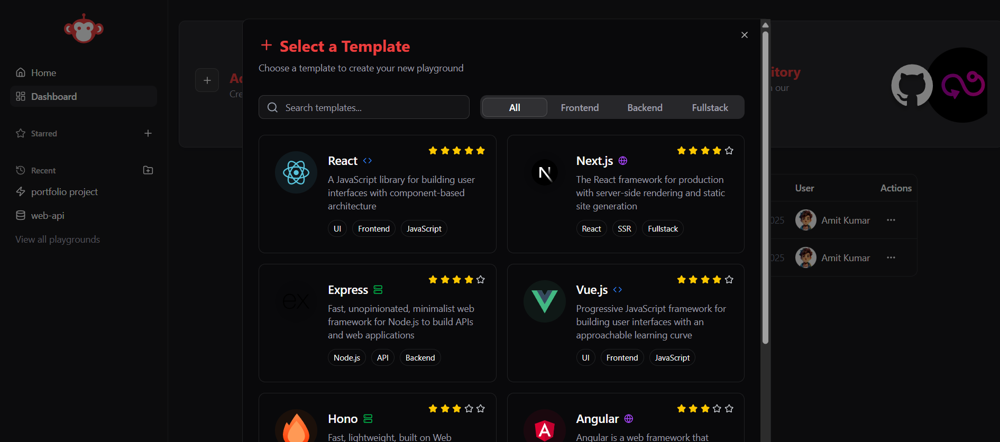
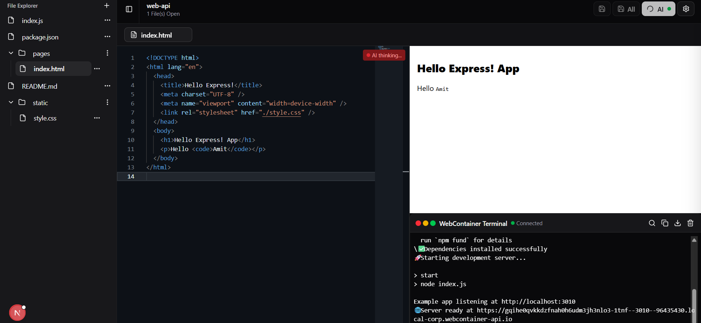
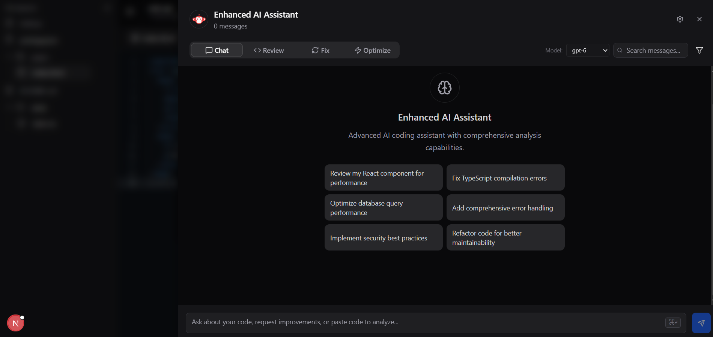

# VibeCode Editor

VibeCode Editor is a blazing-fast **AI-powered web IDE** that runs entirely in your browser — no installation required. Built with **Next.js, WebContainers, Monaco Editor, TailwindCSS, shadcn/ui, and Ollama (local models)**, it provides a complete developer-first experience with real-time execution, intelligent code completion, and seamless file management.

## 📸 Screenshots

### 🔐 Login & Authentication



### 🏠 Dashboard



### 📂 Template Selection



### 💻 Playground with File Explorer & Editor



### 🖥 Built-in Terminal


### ⭐ Project Management




> > > > > > > Stashed changes

## ✨ Features

- ⚡ **Runs fully in the browser** – no setup or installation required.
- 🤖 **AI-powered coding assistant** – autocomplete, formatting, code refactoring, and real-time suggestions powered by Ollama models.
- 🖥 **Modern developer UI** – TailwindCSS + shadcn with light/dark mode support.
- 📂 **Custom File Explorer** – create, rename, delete, and manage files/folders.
- ⌨️ **AI inline suggestions** – press `Ctrl + Space` to get AI-powered code completions and accept with `Tab`.
- 🖥 **Built-in Terminal** – powered by Xterm.js for running commands (`npm run dev`, etc.) directly inside the browser.
- 🔐 **Secure login** – authentication with Google and GitHub.
- 🛠 **Template Playground** – start coding instantly with templates like React, Next.js, Express, Vue.js, Angular, and Hono.
- ⭐ **Project Dashboard** – manage projects, add favorites, duplicate, copy URLs, or delete them in real time.

---

## 🚀 Getting Started

### 1. Clone the repository

```bash
git clone https://github.com/your-username/vibecode-editor.git
cd vibecode-editor
```

### 2. Install dependencies

```bash
npm install
```

### 3. Run the development server

```bash
npm run dev
```

Open [http://localhost:3000](http://localhost:3000) to start coding in your browser.

---

## 🖥 Workflow

1. **Login securely** with Google or GitHub.
2. Land on the **modern landing page** with light/dark mode.
3. Click **Get Started** → go to the **Dashboard**.
   - Left Sidebar → navigation.
   - Right Sidebar → `Add New` project or `Open GitHub Repo`.
4. Select a **template** (React, Next.js, Express, Vue.js, Hono, Angular).
5. Start coding in the **Playground**:
   - File Explorer for file management.
   - Monaco Editor with AI completions.
   - WebContainer + Terminal for running full-stack apps in real time.
   - Enable/Disable AI assistance anytime.

---

## 📦 Tech Stack

- **Frontend**: Next.js, TailwindCSS, shadcn/ui
- **Editor**: Monaco Editor
- **Execution**: WebContainers
- **Terminal**: Xterm.js
- **AI Models**: Ollama (local LLMs)
- **Auth**: Google, GitHub OAuth

---

## 🔮 Roadmap

- [ ] Multi-user collaboration
- [ ] Cloud project storage
- [ ] Offline mode
- [ ] Plugin marketplace for custom AI models and tools

---
